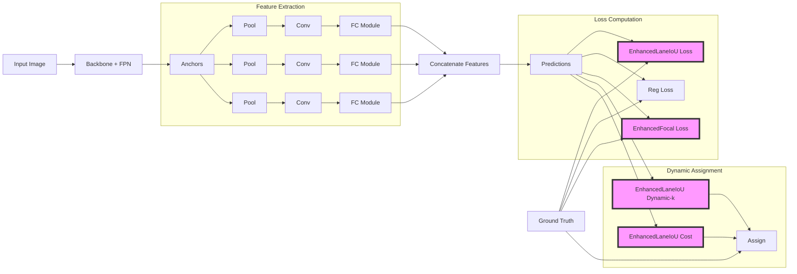
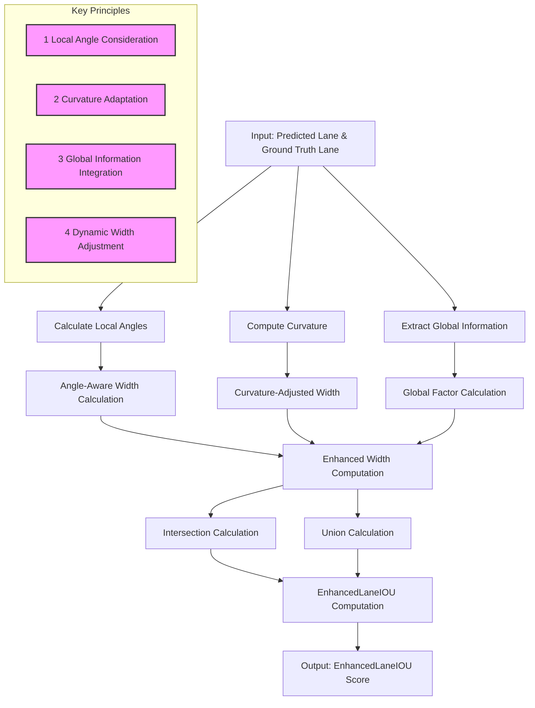

# Lightest-ECLRNet: Advanced Lane Detection with EnhancedLaneIoU and EnhancedFocalLoss

## Method

Lightest-ECLRNet features EnhancedLaneIoU for the target assignment cost and loss functions, along with EnhancedFocalLoss, aiming at improved quality of confidence scores and better handling of complex lane shapes.

EnhancedLaneIoU takes into account local lane angles, curvature, and global information to better correlate with the segmentation-based IoU metric.

EnhancedFocalLoss incorporates edge awareness and curvature information to better address class imbalance and complex lane shapes.





## Performance

Lightest-ECLRNet achieves the **state-of-the-art performance on CULane and CurveLanes benchmarks**, significantly surpassing the baseline.

Model           | Backbone | CULane F1 score | CurveLanes F1 score | GFLOPs
---             | ---      | ---             | ---                 | ---
CLRNet          | DLA34    | 81.43 ± 0.14    | 86.47 ± 0.07        | 18.4
Lightest-ECLRNet| DLA34    | 81.76 ± 0.08    | 86.82 ± 0.06        | 18.4

## Install

Docker environment is recommended for installation:

```bash
docker-compose build --build-arg UID="`id -u`" dev
docker-compose run --rm dev
```

See [Installation Tips](docs/INSTALL.md) for more details.

## Inference

Run the following command to detect the lanes from the image and visualize them:

```bash
python demo/image_demo.py demo/demo.jpg configs/Lightest-ECLRNet/culane/Lightest-ECLRNet_culane_dla34.py Lightest-ECLRNet_culane_dla34.pth --out-file=result.png
```

## Test

Run the following command to evaluate the model on CULane dataset:

```bash
python tools/test.py configs/Lightest-ECLRNet/culane/Lightest-ECLRNet_culane_dla34.py Lightest-ECLRNet_culane_dla34.pth
```

For dataset preparation, please refer to [Dataset Preparation](docs/DATASETS.md).

## Frame Difference Calculation

Filtering out redundant frames during training helps the model avoid overfitting to them. We provide a simple calculator that outputs an npz file containing frame difference values.

```bash
python tools/calculate_frame_diff.py [culane_root_path]
```

## Train

Make sure that the frame difference npz file is prepared as `dataset/culane/list/train_diffs.npz`.

Run the following command to train a model on CULane dataset:

```bash
python tools/train.py configs/Lightest-ECLRNet/culane/Lightest-ECLRNet_culane_dla34.py
```

## Speed Test

Calculate fps by inference iteration.

```bash
python tools/speed_test.py configs/Lightest-ECLRNet/culane/Lightest-ECLRNet_culane_dla34.py Lightest-ECLRNet_culane_dla34.pth --filename demo/demo.jpg --n_iter_warmup 1000 --n_iter_test 10000
```

## References

```BibTeX
@article{author2023Lightest-ECLRNet,
      title={Lightest-ECLRNet: Improving Lane Detection with EnhancedLaneIoU and EnhancedFocalLoss},
      author={[Xingqiang,Chen; Gang,Yuan]},
      journal={arXiv preprint arXiv:xxxx.xxxxx},
      year={2024},
}
```

- [Turoad/CLRNet](https://github.com/Turoad/CLRNet/)
- [lucastabelini/LaneATT](https://github.com/lucastabelini/LaneATT)
- [aliyun/conditional-lane-detection](https://github.com/aliyun/conditional-lane-detection)
- [CULane Dataset](https://xingangpan.github.io/projects/CULane.html)
- [open-mmlab/mmdetection](https://github.com/open-mmlab/mmdetection)
- [optn-mmlab/mmcv](https://github.com/open-mmlab/mmcv)
